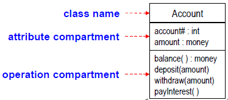
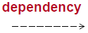
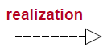
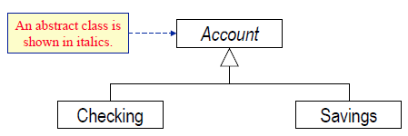
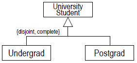
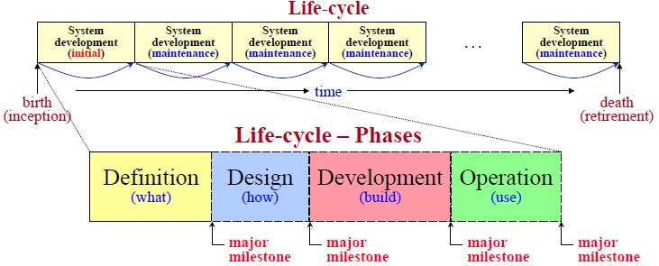
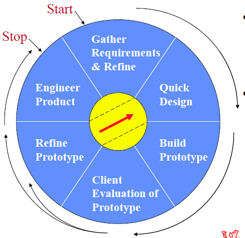
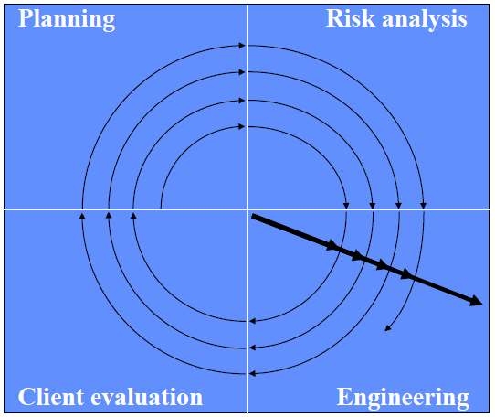
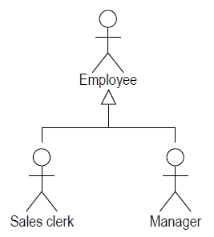

# COMP3111: Software Engineering Final Review

## L01

### Dealing with complexity

---
Having **clear design goals** reduces system's design complexity as it is needed to 
prioritise client's design goals (qualities).

**Modular and Incremental Development** reduces complexity of cost and time estimates

- Module: a part of a system which makes sense to be considered separately
- Interact with module only via **interfaces**, which **abstracts** and **encapsulates** a module to support 
  information hiding. 
- Reduces complexity of understanding (only need to understand interface) and maintaining (changed without 
  effecting the rest of system) the system

**Training Software Engineers** which increase effectiveness of software engineering techniques to reduces complexity of building the system

### Software Engineering

---
- Modeling 
- Problem solving: search solution in the presence of change -> systematic rather than algorithmic
- Knowledge acquistion
- Rationale management

## L02

### UML
---
General purpose visual modeling language for systems. Independent of the software development methodology / 
process. Show essential details while filtering out non-essential ones to focus on the **programming-in-the-large**.

**OO-modeling** reduces semantic gap between application model and model:

- Requirement level: focus identifying objects without implementation. Consists of defining class
- Analysis & Design level: focus on interfaces of object, how objects interact
- Implementation level: focus on detail of objects, how to code

### Class

---
Describes a collection of objects (instances) which capture one abstraction theme. Reduces complexity of 
understanding and specifying the system. Helps modular development.

**Attribute** describes data values held by objects, consists of: 

- name
- [type]
- visibility (public (+), private (-), protected (#), package (~))
- [initial value]
- [multiplicity]
- changeability

**Operation**: function / transformation applied to the class. **Method**: operation instance. Consists of: 

- operation signature (name, params. names, result type)
-visibiliity.

### Association

---
Description of the links (relationship instance) between two objects. Collection of names and association
names must be unique.

Degree of association:

- **Unary** (reflexive): relates one class to itself, requires **role** is one end of an association
- **Binary** : relates two classes, etc

**Multiplicity** specifies restriction on the number of objects in a class that related to **one** object
in another class.

- Minimum cardinality = 0 : optional participation
- Minimum cardinality > 0 : mandatory participation (must be related)
- Maximum cardinality = * : unlimited upper bound
- Min-card = 1 & max-card = 1 : 1
- Min-card = 0 & max-card = * : *

**"part-of" / "made-of" relationship**. Use association when in doubt.

- **Aggregation** (hollow rhombus) : a component may exist independent of the aggregate object of which it is
a part. Not necessarily have the same life-cycle. Min-card = 0 & max-card = 1 or *. Not every "has"
relationship are aggregations.
- **Composition** (full rhombus) : may not exist independent and have to have same life-cycle. Min-card = 0 
& max-card = 1 or *.

### Dynamic model

---

**Dependency** relates classes whose behaviour / implementation affect other classes.

- **Flow** relates two versions of an object at successive times
- **Usage** shows that one class requires another class for its functioning

**Realisation** relates a specification to its implementation

## L03

**Association class** is used when the association has attribute, most often needed for many-to-many associations.

### Generalisation

---
Relationship between classes of the same kind. **Discriminator**: attribute of enumeration type that indicates which property of a class is used to create a generalisation relationship. Top-down is specialisation, bottom-up is generalisation.

**Inheritance** takes up properties by subclass from its superclass, so properties only defined in one place. Reduces redundancy, promotes reusability, simplifies modification. 2 types of coverage:

1. Disjointess:
   - **Overlapping**: superclass object can be member of more than one subclass
   - **Disjoint**: superclass object can be member of at most one subclass

2. Completeness:

   - **Complete**: all superclass object must be member of some subclass
   - **Incomplete**: some superclass object isn't a member of any subclass

   

**Abstract class** is used as a container for definitions, no instances. Applicable for operations as well, which means no method specified.

**Constraint** is an assertion about properties of model elements which must be satisfied. Consists of: ordering, subset, xor (related to either, not both).

## L04

### Software Development Projects

---

Stages of software development:

- Gather system **requirements**
- **Analyse and design** the system
- **Implement** the system
- **Test** the system

Types of software development projects:

- Green field: new development
- Evolutionary: maintenance
- Framework / component: reuse. A **framework** is a software designed to be reused while needing to be adapted

### Risk

---

**Risk analysis** involves estimating:

- Likelihood (Ii) that the risk (ri) will occur and establish a scale
- Consequences and impact (xi) of the risk
- Accuracy / confidence of the projection

Prioritize risks by perceived impact on the project

**Risk planning** consists of strategies development to monitor and manage risks. **80:20 rule**: 80% of the project risk is accounted for by 20% of identified risks. 

### Project Organisation

---

Project organization specifies roles and responsibilities, number of staff in each role, and teams. **Task**: a well-defined work assignment for a role. **Activity**: a group of related tasks. **Estimating** is trying to quantify something before it occurs.

**Plan-driven**: tasks, activities, and schedules are planned in detail at the start. **Agile-driven**: incrementally planned as the project progresses.

**Process** is a complete set of activities / workflows and their sequencing that transforms user requirements into a software product. 

## L05

Software development process have to consider the characteristics of organisation, project, and people.

### Monolithic

---

**Waterfall** process should be used when requirements are well understood and unlikely to change. It produces **requirements** specification, **design** specification, implemented collection of **modules**, **tested assembly** of modules, and keep the system **working** and up-to-date.

**Pros**: rigid, easy to monitor, enforce documentation standards before proceeding. **Cons**: assume possible linear and sequential development, each phase can be frozen due to rigidness, little opportunity for user feedback.

### Iterative and Incremental

---

#### Code-and-fix

Cycle in implementation and testing with many changes and becomes messy, unpredictable, and uncontrollable. With no requirements specification, often unsuitable for large systems.

#### Prototyping

is a code-and-fix with client evaluation and enforces discipline. Useful when requirements are vague or unknown as it allows exploration. Final prototype follows the **80:20 rule**: 80% of the effort is for 20% of code development.

**Pros**: explored requirements and different solutions, allows user feedback and approval. **Cons**: progress hard to measure, poor or absent documentation, final product is not a complete system.

#### Spiral

**Pros**: risk evaluation reduce problems, planning and client evaluation phases, iterative and incremental planning and evaluation. **Cons**: relies on expertise, needs more elaboration of the phases, suitable for internal rather than contract development.

#### Phased-release

Releases are developed and uses in parallel as change is inevitable. Two types of development:

- **Incremental**: partial system, full functionality
- **Iterative**: full system, partial functionality

**Pros**: reduces risk of failure, promotes modularity, fallows frequent releases and appropriate expertise applied as well as early training. **Cons**: difficult to identify common facilities needed by all pieces, system pieces need to be relatively small.

#### Agile

Any incremental phased approach where focused on individuals and interactions, working software, client collaboration, and responsive to change. Three practises:

- **Planning poker**: for estimating time required to implement a feature
- **Pair programming**: for write code for a feature
- **Test Driven Development**: used to test the code

Two methods:

- **Extreme Programming**: allow client to direct the software development process by selecting features in each iteration, not only specifying requirements. Developer breaks each iteration into tasks done in parallel, that the test cases is designed by pair programming.
- **Scrum**: requirements are captured as items in **product backlog** where the clients sets the priorities. Feature in **sprint backlog** from product backlog is then developed, tested in one **sprints** (series of iterations) for which teams is self-organised. Requirements not allowed to change in a sprint. **Burndown chart** shows total hours remaining each day to complete the sprint.

**Pros**: flexible, immediate feedback, fewer defect, faster speed-to-market. **Cons**: daily stand-up meetings and more collaboration required, lack documentation.

### Unified Process (UP)

---

Referred as whale-hump picture. Provides generic process framework while defining a set of activities (workflows) and models (artifacts). Each iteration (vertical) produces working product, while each increment (horizontal) establishes a system baseline.

## L06

### Requirements

---

Requirement specifies problem (what it should do), not solution (how it is done). Capturing requirement reduces error and cost of software development (cost of defect in requirements are amplified towards the system usage). Two types of requirements:

- **User** requirement: mainly for client consisting of constraints and what system provides
- **System** requirement: for client and developer consisting of what should be implemented and detailed description

Requirement capture activities include: understanding application domain and user needs, determine risks, capture and validate system requirements 

**Domain modeling** captures most important (without anything irrelevant and describing operation, action, and implementation constructs) classes and their associations by **decomposing** user requirements, which described in class diagram. 

## L08

### Use-case Modeling

---

Captures **system behaviour** from users' POV by describing all required functionality. 

**Actor** represents something outside the system that interacts directly with the system, provides input and receives output. 

**Use case** is a specific way of using the system by performing some of the system's functionalities, describing the interaction between actor and system, constituting a complete normal sequence of events / actions. Represents a major piece of complete functionality

Provides brief description of the purpose of each use case and outline of steps required (**flow of events**) to perform the use case as the use-case specification.

**Scenario** is concrete, informal description of a use of the system (**instance of use case**) from the POV of a single actor. Two viewpoints:

- **Top-down**: start with use cases, refine with scenarios
- **Bottom-up**: start with scenarios, abstract to use cases. 

## L09

### Use-case Details

---

**Precondition** statement about the system, actor must be in for the use case to be performed. Stated so each use-case descriptions are independent to each other

**Postcondition** statement about the state of system is in at the end of a use-case, about the result of executing the use case. Only used when the use case ends is important for another's use case precondition, and when possible outcomes are not obvious.

### Flow of Events

---

Flow of events is a precise and easy to read description of sequence of actions needed for a use case, what should be done, not how it is being done. It is a sequence of numbered, time-ordered, event-response oriented short steps.

**Basic flow**: most common path, one complete sequence of actions to mitigate risk of misunderstanding and ambiguity. **Alternative flows**: optional, exception behaviour and infrequent used functionality which is uniquely-named and defined by **extension point**, consisting of:

- **Specific** alternative flow: starts at specific named point in another flow of events
- **Bounder** alternative flow: occur between two points
- **General** alternative flow: able to start at any point

First line and last line of an alternative flow's flow of events should state explicitly where the actor starts and resumes the original flow of events.

**Extension point**: named place in the flow of events where additional behaviour can take place. Kinds of extension points:

- **Single location**
- **Set of discrete locations**: multiple places
- **Region**: pair of extension points which delineates set of locations in-between.

**Subflow** is a numbered and uniquely-named segment of behaviour within a flow of events to improve readability. It is not a separate use case, rather an integral part.

## L10

**Non-functional requirement** places constraint on a use case / system. It is specified as **supplementary requirements** in **non-functional requirements** which is use cases that deal with non-functional requirements.

**System Requirement Specification (SRS)** should be validated continuously to verify its completeness, consistency, clearness, correctness, realistic. **Acceptance tests** are used to validate the requirement satisfaction of the system implementation.

### System Requirements Capture

---

**Domain modeling** captures data requirements by using class diagram which shows different classes and relationships.

**Use-case modeling** captures functional requirements by using use-case model (provide system functionality and the actors which used it) and flow of events (describe sequence of actions).

**Requirement validation** verifies the system meets all requirements. These system requirements is documented in **SRS**.

## L11

### Implementation 

---

