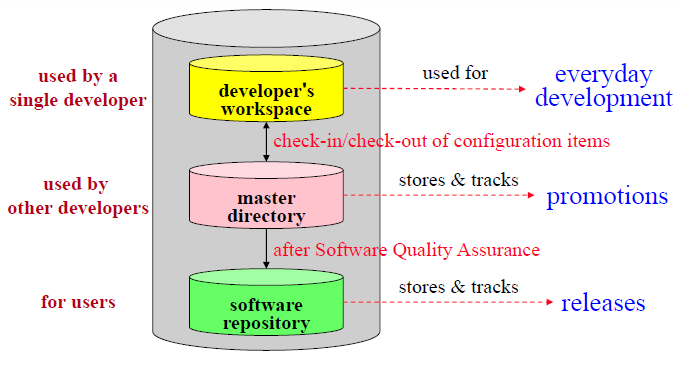
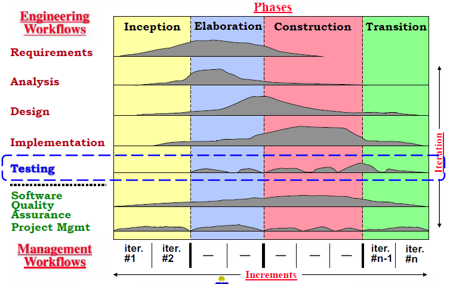
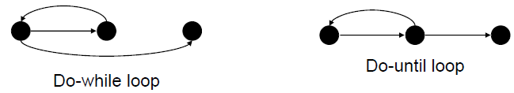
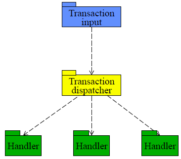
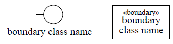
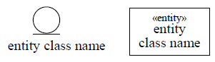
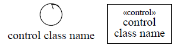
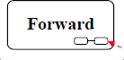

# COMP3111: Software Engineering Final Review

## L01

### Dealing with complexity

Having **clear design goals** reduces system's design complexity as it is needed to 
prioritise client's design goals (qualities).


**Modular and Incremental Development** reduces complexity of cost and time estimates

- Module: a part of a system which makes sense to be considered separately
- Interact with module only via **interfaces**, which **abstracts** and **encapsulates** a module to support 
  information hiding. 
- Reduces complexity of understanding (only need to understand interface) and maintaining (changed without 
  effecting the rest of system) the system


**Training Software Engineers** which increase effectiveness of software engineering techniques to reduces complexity of building the system


### Software Engineering

- Modeling 
- Problem solving: search solution in the presence of change -> systematic rather than algorithmic
- Knowledge acquistion
- Rationale management


## L02

### UML
General purpose visual modeling language for systems. Independent of the software development methodology / 
process. Show essential details while filtering out non-essential ones to focus on the **programming-in-the-large** (see it from the bigger picture).


**OO-modeling** reduces semantic gap between application model and model:

- Requirement level: focus identifying objects without implementation. Consists of defining class
- Analysis & Design level: focus on interfaces of object, how objects interact
- Implementation level: focus on detail of objects, how to code


**Key points** on designing UML model:

- Do not represent operations(generate, browse, enter, lookup) as associations. ==Associations is result of operations, not the operation itself==
- Do not represent implementation aspects (System, telephone, reports), and client / organisation
- ==Consider what information about things / procedures needs to be persistent (in files & database)==. If not, no need to include. 


### Class

Describes a collection of objects (instances) which capture one abstraction theme. Reduces complexity of 
understanding and specifying the system. Helps modular development.


**Attribute** describes data values held by objects, consists of: 

- name
- [type]
- visibility (public (+), private (-), protected (#), package (~))
- [initial value]
- [multiplicity]
- changeability


**Operation**: function / transformation applied to the class. **Method**: operation instance. Consists of: 

- operation signature (name, params. names, result type)
  -visibiliity.


### Association

Description of the links (relationship instance) between two objects. Collection of names and association
names must be unique.


Degree of association:

- **Unary** (reflexive): relates one class to itself, requires **role** is one end of an association
- **Binary** : relates two classes, etc


**Multiplicity** specifies restriction on the number of objects in a class that related to **one** object
in another class.

- Minimum cardinality = 0 : optional participation
- Minimum cardinality > 0 : mandatory participation (must be related)
- Maximum cardinality = * : unlimited upper bound
- Min-card = 1 & max-card = 1 : 1
- Min-card = 0 & max-card = * : *


**"part-of" / "made-of" relationship**. Use association when in doubt.

- **Aggregation** (hollow rhombus) : a component may exist independent of the aggregate object of which it is
a part. Not necessarily have the same life-cycle. Min-card = 0 & max-card = 1 or *. Not every "has"
relationship are aggregations.
- **Composition** (full rhombus) : may not exist independent and have to have same life-cycle. Min-card = 0 
& max-card = 1 or *.


### Dynamic model

**Dependency** relates classes whose behaviour / implementation affect other classes.

- **Flow** relates two versions of an object at successive times
- **Usage** shows that one class requires another class for its functioning


**Realisation** relates a specification to its implementation / interface


## L03

**Association class** is used when the association has attribute, most often needed for many-to-many associations.


### Generalisation

Relationship between classes of the same kind. **Discriminator**: attribute of enumeration type that indicates which property of a class is used to create a generalisation relationship. Top-down is specialisation, bottom-up is generalisation.


**Inheritance** takes up properties by subclass from its superclass, so properties only defined in one place. Reduces redundancy, promotes reusability, simplifies modification. 2 types of coverage:

1. Disjointess:
   - **Overlapping**: superclass object can be member of more than one subclass
   - **Disjoint**: superclass object can be member of at most one subclass

2. Completeness:

   - **Complete**: all superclass object must be member of some subclass
   - **Incomplete**: some superclass object isn't a member of any subclass

   


**Abstract class** is used as a container for definitions, no instances. Applicable for operations as well, which means no method specified.


**Constraint** is an assertion about properties of model elements which must be satisfied. Consists of: ordering, subset, xor (related to either, not both).


## L04

### Software Development Projects

Stages of software development:

- Gather system **requirements**
- **Analyse and design** the system
- **Implement** the system
- **Test** the system


Types of software development projects:

- Green field: new development
- Evolutionary: maintenance
- **Custom**: development effort is high
- Framework / component: reuse. A **framework** is a software designed to be reused while needing to be adapted


### Risk

**Risk analysis** involves estimating:

- Likelihood (I<sub>i</sub>) that the risk (r<sub>i</sub>) will occur and establish a scale
- Consequences and impact (x<sub>i</sub>) of the risk
- Accuracy / confidence of the projection

Prioritize risks by perceived impact on the project


**Risk planning** consists of strategies development to monitor and manage risks. **80:20 rule**: 80% of the project risk is accounted for by 20% of identified risks. 


### Project Organisation

Project organization specifies roles and responsibilities, number of staff in each role, and teams. **Task**: a well-defined work assignment for a role. **Activity**: a group of related tasks. **Estimating** is trying to quantify something before it occurs.


**Plan-driven**: tasks, activities, and schedules are planned in detail at the start. **Agile-driven**: incrementally planned as the project progresses.


**Process** is a complete set of activities / workflows and their sequencing that transforms user requirements into a software product. 


## L05

Software development process have to consider the characteristics of organisation, project, and people.


### Monolithic

**Waterfall** process should be used when requirements are well understood and unlikely to change. It produces **requirements** specification, **design** specification, implemented collection of **modules**, **tested assembly** of modules, and keep the system **working** and up-to-date.


**Pros**: rigid, easy to monitor, enforce documentation standards before proceeding. **Cons**: assume possible linear and sequential development, each phase can be frozen due to rigidness, little opportunity for user feedback.


### Iterative and Incremental

#### Code-and-fix

Cycle in implementation and testing with many changes and becomes messy, unpredictable, and uncontrollable. With no requirements specification, often unsuitable for large systems.


#### Prototyping

is a code-and-fix with client evaluation and enforces discipline. Useful when requirements are vague or unknown as it allows exploration. Final prototype follows the **80:20 rule**: 80% of the effort is for 20% of code development.


**Pros**: explored requirements and different solutions, allows user feedback and approval. **Cons**: progress hard to measure, poor or absent documentation, final product is not a complete system.


#### Spiral

**Pros**: risk evaluation reduce problems, planning and client evaluation phases, iterative and incremental planning and evaluation. **Cons**: relies on expertise, needs more elaboration of the phases, suitable for internal rather than contract development.


#### Phased-release

Releases are developed and uses in parallel as change is inevitable. Two types of development:

- **Incremental**: partial system, full functionality
- **Iterative**: full system, partial functionality


**Pros**: reduces risk of failure, promotes modularity, fallows frequent releases and appropriate expertise applied as well as early training. **Cons**: difficult to identify common facilities needed by all pieces, system pieces need to be relatively small.


#### Agile

Any incremental phased approach where focused on individuals and interactions, working software, client collaboration, and responsive to change. Three practises:

- **Planning poker**: for estimating time required to implement a feature
- **Pair programming**: for write code for a feature
- **Test Driven Development**: used to test the code

Two methods:

- **Extreme Programming**: allow client to direct the software development process by selecting features in each iteration, not only specifying requirements. Developer breaks each iteration into tasks done in parallel, that the test cases is designed by pair programming.
- **Scrum**: requirements are captured as items in **product backlog** where the clients sets the priorities. Feature in **sprint backlog** from product backlog is then developed, tested in one **sprints** (series of iterations) for which teams is self-organised. Requirements not allowed to change in a sprint. **Burndown chart** shows total hours remaining each day to complete the sprint.


**Pros**: flexible, immediate feedback, fewer defect, faster speed-to-market. **Cons**: daily stand-up meetings and more collaboration required, lack documentation.


#### ==Principles==

- Rigor and formality: waterfall, spiral
- Separation, modularity: waterfall, spiral, phased-release
- Abstraction, generality: waterfall, spiral
- Change anticipation: spiral, phased-release, agile
- Incremental development: prototyping, spiral, phased-release, agile
- Risk assessment: spiral


### Unified Process (UP)

Referred as whale-hump picture. Provides generic process framework while defining a set of activities (workflows) and models (artifacts). Each iteration (vertical) produces working product, while each increment (horizontal) establishes a system baseline.


## L06

### Requirements

Requirement specifies problem (what it should do), not solution (how it is done). Capturing requirement reduces error and cost of software development (cost of defect in requirements are amplified towards the system usage). Two types of requirements:

- **User** requirement: mainly for client consisting of constraints and what system provides
- **System** requirement: for client and developer consisting of what should be implemented and detailed description


Requirement capture activities include: understanding application domain and user needs, determine risks, capture and validate system requirements 


**Domain modeling** captures most important (without anything irrelevant and describing operation, action, and implementation constructs) classes and their associations by **decomposing** user requirements, which described in class diagram. 


## L08

### Use-case Modeling

Captures **system behaviour** from users' POV by describing all required functionality. 


**Actor** represents something outside the system that interacts directly with the system, provides input and receives output. System, devices, input and output devices are not actors. 


**Use case** is a specific way of using the system by performing some of the system's functionalities, describing the interaction between actor and system, constituting a complete normal sequence of events / actions. Represents a major piece of complete functionality


Provides brief description of the purpose of each use case and outline of steps required (**flow of events**) to perform the use case as the use-case specification.


**Scenario** is concrete, informal description of a use of the system (**instance of use case**) from the POV of a single actor. Two viewpoints:

- **Top-down**: start with use cases, refine with scenarios
- **Bottom-up**: start with scenarios, abstract to use cases. 


## L09

### Use-case Details

**Precondition** statement about the system, actor must be in for the use case to be performed. Stated so each use-case descriptions are independent to each other


**Postcondition** statement about the state of system is in at the end of a use-case, about the result of executing the use case. Only used when the use case ends is important for another's use case precondition, and when possible outcomes are not obvious.


### Flow of Events

Flow of events is a precise and easy to read description of sequence of actions needed for a use case, what should be done, not how it is being done. It is a sequence of numbered, time-ordered, event-response oriented short steps.


**Basic flow**: most common path, one complete sequence of actions to mitigate risk of misunderstanding and ambiguity. **Alternative flows**: optional, exception behaviour and infrequent used functionality which is uniquely-named and defined by **extension point**, consisting of:

- **Specific** alternative flow: starts at specific named point in another flow of events
- **Bounder** alternative flow: occur between two points
- **General** alternative flow: able to start at any point


First line and last line of an alternative flow's flow of events should state explicitly where the actor starts and resumes the original flow of events.


**Extension point**: named place in the flow of events where additional behaviour can take place. Kinds of extension points:

- **Single location**
- **Set of discrete locations**: multiple places
- **Region**: pair of extension points which delineates set of locations in-between.


**Subflow** is a numbered and uniquely-named segment of behaviour within a flow of events to improve readability. It is not a separate use case, rather an integral part.


## L10

**Non-functional requirement** places constraint on a use case / system. It is specified as **supplementary requirements** in **non-functional requirements** which is use cases that deal with non-functional requirements.


**System Requirement Specification (SRS)** should be validated continuously to verify its completeness, consistency, clearness, correctness, realistic. **Acceptance tests** are used to validate the requirement satisfaction of the system implementation.


### System Requirements Capture

**Domain modeling** captures data requirements by using class diagram which shows different classes and relationships.


**Use-case modeling** captures functional requirements by using use-case model (provide system functionality and the actors which used it) and flow of events (describe sequence of actions).


**Requirement validation** verifies the system meets all requirements. These system requirements is documented in **SRS**.


## L11

### Implementation 

**Module**: physical and replaceable part of the system which packages implementation and provide set of interfaces. **Subsystem** organises modules. Modules and subsystems then compiled into executable modules.


### Defensive Programming 

Values of all data from external resources and all routine input parameters are checked, bad inputs is handled. **Barricade** are converting input data to the proper type at **input time** using **assertions** on pre-, post-condition, and invalid input. 


**Precondition** is an assertion inserted prior to execution; **postcondition** is an assertion inserted after execution.


**Forward reasoning** (more intuitive) knows the precondition, and predict the postcondition. **Backward reasoning** knows the postcondition, predict the precondition.


**Refactoring**: improving part of software's internal structure without altering its external behaviour, to maintain the code execute its functionality, allow change, and communicate well. Where **low-level refactor** is supported on IDE, the **high-level refactoring** includes exchanging obscure language idioms, statements clarifying, performance optimisation, design pattens refactoring.


## L12

### Debugging Defense

Use debug as a last resort. **Modularity**: take away pieces until bug disappears, and add pieces back in until bug appears. **Modular reasoning**: trace through programme while viewing intermediate results.


**Regression testing**: add a test for whenever a bug was found. Then re-run all the test.


### Configuration Management (CM)

**Change Management** ensures that a system evolution is a managed process which give priority to the most urgent and cost-effective changes. The change management is supported by software library which provide facilities to store, control version and track configuration items' status. **Configuration item**: artifact going to be controlled changes.




**Baseline** is a time / phase in the software development after which any changes must be formalised. **Change control** defines the formal process of making changes to a project, for which the change control authority evaluates it. 


**Auditing** ensures that changes have been properly implemented, usually done by Quality Assurance. **Status reporting**: communication mechanism that keeps all parties informed on the status of the change. **Version management** ensures integrity and consistency of configuration items, described by **evolution graph** shows an item's change history.


## L13

### Testing




In inception, elaboration, and construction, the focus is on integration and system test. Transition focuses on fixing bugs and regression testing.


**Testing** finds difference between expected and actual system behaviour through:

- **Validation**: build the right product, meet requirements through acceptance test
- **Verification**: build the product right, quality of implementation

'

**Input space partitioning**: partition inputs into sets which shares same behaviour to test each value from each set. Two approaches:

- **Naive approach**: execution equivalence
- **Better approach**: revealing subdomains (subset of possible inputs). Partition by heuristics on program-dependent and program-independent information.


### Design Tests

#### White Box Test

verifies component logic using knowledge of the internal workings of the component. 


**Basis path testing** executes each independent path at least once by determining set of linearly independent paths based on cyclomatic complexity from the flow graph.


**Cyclomatic complexity, V(G)**: quantitative measure of logical complexity, provides upper bound on number of paths needed to be tested. 


```markdown
V(G) = number of regions (areas bounded by nodes and edges including area outside graphs) 
V(G) = #edges - #nodes + 2 
V(G) = # simple predicate nodes + 1
```


**Independent path** must traverse at least one edge in the flow graph that hasn't been traversed before. **Basis set** is the set of linearly independent paths which is not unique, but guarantees to execute every statement at least once. Basis path testing doesn't test all possible combinations of all paths.





#### Black Box

verifies component functionality based on inputs and outputs based on knowledge of specified functionality


#### Regression

 verifies no new defects are introduced after change


## L14

### White Box Testing

**Condition testing** executes true and false value of each simple logical condition through:

- **Branch testing**: test every true and false branches, as covered in basis path testing
- **Domain testing**: detection of rel-op (relation operation) error. For expression E<sub>1</sub> rel-op E<sub>2</sub>, test E<sub>1</sub> > E<sub>2</sub>, E<sub>1</sub> = E<sub>2</sub>, E<sub>1</sub> < E<sub>2</sub> with the difference as small as possible.


**Loop testing** executes loops at and within their bounds through:

- Simple loops
- Nested loops: simple loop test for the innermost while holding outer loops at their minimum iteration values. Work outward
- Concatenated loops: use simple loop testing for independent loops, nested loop testing for dependent.


**Data flow testing** ensures variable value is correct at a certain points of execution by selecting test paths based on locations of definitions (S) and uses (S') of a variable (X).


**Use (DU) Chain (X)** is the set of [X, S, S'] where X is not redefined between S and S`. Test every variable along the path from where the variable is defined to where the variable is used, combined with basis path testing.


### Black Box Testing

Cover a range of input and output values to test the presence or absence of a class of errors. **Equivalence partitioning** creates subdomains by grouping inputs and outputs by type to create test coverage. Select subdomains based on its validity and invalidity.


**Boundary testing** uses values at the boundaries of a main subdomain. Use minimum values of subdomains which represent both validity and invalidity, and use the minimum and maximum values, as well as just above and just below each the boundary.


**Thread testing**: event-based approach where tests are based on event which trigger system actions, used after unit test.


**State-based testing** compare the resulting state of a class with the expected ones. Test cases was derived using state machine diagram, and derived a representative set of stimuli / events for each transition / equivalence testing.


**Regression testing**: reproduces the bug while recording the input and correct output, and then the test is put into test suit to prevent bug occurrence in the future.


## L15

**Test component**: program that automates one or several, parts or all test procedures. As we develop the system outside in (from client's acceptance testing to unit testing), we test the system inside out.


### Testing Strategy

#### Unit testing

uses both white and black box test to verify the components function correctly. May require **driver** (component which calls component to be tested) and **stubs** (component called to be tested).


#### Integration testing

uses both white and black box test to verify the subsystems interact correctly.


**Top down**: test top sub-system with stubs, and stubs replaced one at a time, depth- or breadth-first. If new sub-system integrated, do regression testing. 

- Pros: early testing and error detection
- Cons: low-level processing is done late, require stubs


**Bottom up**: subsystems are grouped into builds and integrated. Drivers are replaced one at a time depth-first. 

- Pros: interaction fault easily found, easier test case, no stubs
- Cons: user interaction tested last


**Sandwich**: top level subsystems tested with stubs, lower level are grouped into build and tested with driver.

- Pros: parallel testing, shorten testing time
- Cons: require drivers and stubs


#### System testing

uses black box test to verify the system functions correctly as a whole. Consists of:

- Functional: verify system met requirements specification.
- Performance: design goals & nonfunctional requirements met
- Pilot: end users verifies common functionality in the target environment. **Alpha test**: test in controlled environment that users can be observed. **Beta test**: test in real environment where bugs uncovered from regular usage patterns.
- Acceptance: verifies function / constraint is fully operational and requirement is met to client.
- Installation: verifies usability and validates requirements


#### Acceptance Test

uses black box test to validate against requirements.


## L16

**System analysis and design** structures use-case model and prepares it for implementation to provide precise and detailed understanding of the requirements.


### Architectural Analysis and Design

**Subsystem layers** consists of:

- **Closed layered**: depend only on the layer immediately below it. Lower coupling, higher overhead
- **Open layered**: depend on any layer below it. Higher coupling, less overhead


**Subsystem partition** organises subsystems in one layer into different services, resulted in peer to peer services within a layer.


### Architectural Pattern

**Multi-layer**: software in layers so that each layer only communicate with the one below it.


**Repository**: centralise data management. Control flow is dictated through via triggers or subsystems using locks to synchronise. Cons: performance and modifiability bottleneck, high coupling between repo and subsystems.


**Client-server**: separate and distribute system's functionality. Two types:

- **Three-tier**: server communicates with client and database server
- **Peer-to-peer**: each subsystem can be both a server and a client. Control flow is independent from others except synchronisation request


**Broker**: distribute aspects of the system transparently to different nodes, such as proxy design pattern.


**Transaction Processing**: direct input to specialised subsystems (handlers), through transaction dispatcher which decide what to do with each input transaction.




**Pipe-and-filter**: provide flexibility, modifiability, and reusability of subsystems which can be done concurrently. Input is passed through series of subsystems / filters as pipeline, each of which transform it. 


**Model-view-controller (MVC)**: separate user interface layer from other parts. 


### Use-case Analysis

**Analysis class**: abstraction of one or several classes in the final system implementation. 


**Boundary class** models the interaction between system and actors which represents an abstraction of UI elements / communication interface.




**Entity class** models information that is often persistent in database, represent the concept of individual, real-life object or event. 




**Control class** models coordination, sequencing, transactions, and control behaviour. Responsible for the flow of events, and only tied to at most one actor. It usually does not have a correspondence in the application domain. 




**Cohesion** is a measure of number of a class functionality, desired to be high. Most cohesive is when it only does one thing. **Coupling** is a measure of number and types of dependencies, desired to be low. Lowest coupling has minimal dependencies.


## L17

### State Machine Diagram

State Machine describes the behaviour inside an object. It is directed graph from states of the object (**nodes**) to events that cause state changes (**arcs**).


**State** is a time during the life of an object when it satisfies, performs, and waits for an event. Unnamed state is called **anonymous**. There is initial (start) state, and final (end) state.


**Transition** is a change of state from source / originating state to successor / target state. It is uninterrupted, caused by an event trigger, and optionally an **guard condition** (Boolean expression which must be true). **Effect list**: atomic expression executed if and when a transition fires.


**Event**: something that happens at an instantaneous point in time. Types of event:

- Call event: receipt of a synchronous call (request that an operation to be performed)
- Signal event: receipt of an asynchronous communication
- Change event: specified Boolean condition becoming true
- Time event: absolute time / elapsed time


Events are processed one at a time, and one transition within a state machine may fire. Transition out of a state can be **automatic** (activity of the state completes) or **non-automatic** (caused by an event).


**Action**: process transition between states which is instantaneous and can't be interrupted. **Activity**: a process in a state which takes time and can be interrupted.


### Composite State Machine Diagram

Composite SMD contains one or more nested SMD.




**Sequential composite**: exactly one state in one of the nested state machine diagrams. Corresponds to or-condition, used to abstract / generalise states.


**Concurrent composite**: exactly one state in each of the regions of the state machine diagrams. Corresponds to and-condition, for multi-threading behaviour. 


Transitions in composite state may have multiple source and target states, which represent synchronisation or splitting of control. **Synchronisation bar** which occurs  to the boundary (fork) and from the boundary (join) is used for synchronisation.


## L18

### Design Patterns

Design pattern is a general reusable solution to commonly occurring problem. It facilitates reuse of successful software design which is documented in a **pattern catalog**. 


==**Design principle**==: 

- Identify aspects of application that vary and separate them from what stays the same. 
- Program to an interface, not an implementation.
- Favour composition (has-a relationship) over inheritance (is-a relationship).
- Strive for loosely coupled designs between objects that interact to minimise the interdependency.
- Classes should be open for extension, but closed for modification (**open-closed principle**)


**Design patterns space**:

- Creational patterns: initialising and configuring classes and objects
- Structural patterns: decoupling interface and implementation
- Behavioural patterns: dynamic interactions among societies of classes and objects
- Concurrency patterns: multi-threaded programming


**Observer**  pattern defines a one-to-many dependency between objects, so that when an object changes state, the dependents are notified and updated automatically.


## L19

### Design Patterns

**Mediator** pattern is commonly used to coordinate related GUI components. Mediator class defines interface for communicating with Colleague objects.

- Pros: decoupled colleagues, comprehension, simplified object protocols, limits subclassing
- Cons: complexity


**Proxy** pattern uses an proxy that acts as a stand-in (surrogate) for the real expensive object. Proxy class maintains reference to the real subject for which it control access to the real subject and responsible for it.


**Bridge** pattern solves the mix of design (abstractions) and implementation inheritance hierarchies by separating the object abstraction and implementation class hierarchies and connect them using a bridge.


**Singleton** pattern make the class responsible for keeping track of its sole instance, ensure that no other instance can be created, and provide a way to access the instance.


**Simple factory** pattern enables user to decide at runtime specific subclass instantiation using the open-closed principle.


### Anti Patterns

Anti pattern tells what is a bad solution, used as tools for social control.


**Spaghetti code**: software where it has reached a point of diminishing returns where the effort involved to maintain existing code exceeds the cost of developing a new solution.


**Blob / god class**: a single class with many attributes / operations which violates the cohesion property of object-oriented design.


## L20

**Quality Assurance** consists of procedures, techniques, and tools to ensure that a product meets or exceeds standards during development cycle. **Quality control** ensures standards are followed, **quality planning** selects and tailors standards, **quality assurance** defines organisational standards.


###  Software Quality Activity

**Technical standard** is requirement that establishes uniform technical criteria, methods, etc. 

- **Product** standard focuses on what outcome is produced and define characteristics of the product artifacts should exhibit.
- **Process** standard focuses on how outcome is produced and how the software process should be conducted.


**Metrics** is a objective way to measure software product, process, or artifact. It is used to control development process and predict product quality. 


### Quality Metrics for System Design

For design component, a design goal is maintainability.

#### Structural fan-in / fan-out

**Fan-in**: number of calls to a component by other component. Higher fan-in, higher coupling.


**Fan-out**: number of components called. Higher fan-out, high complexity (for calling component).


#### Informational fan-in / fan-out

Considering the number of parameters passed + number of accesses to shared data structures. Useful predictor of effort required for implementation.

```markdown
Complexity = component-length * (fan-in * fan-out)^2
```


#### IEEE Standard

Considers properties of subsystems (number of subsystems and degree of coupling) and database (number of attributes and classes). 


**DSQI (Design Structure Quality Index)** is computed, with the value [0,1]. Lower DSQI, further work may be required.


Also able to consider changes made throughout product's history and compute the stability.


**SMI (Software Maturity Index)** is computer; with the value [0,1]. Higher SMI, the more stabile.


### Quality Metrics for Implementation

For implementation component, design goals are reliability and ease of implementation. Measured based on lines of code, length of identifiers, depth of conditional nesting.


**Halstead's Software Science** measures based on number of operators and operands in a component, then calculate the values for component volume V (bits), component difficulty D, and effort E required to implement.


**McCabe's Complexity Metric** measures based on control flow in a component and calculates cyclomatic complexity.


### Achieving Product Quality

**Statistical Quality Assurance** categorises and determines causes of software defects based on 80-20 rule: 80% defect caused by 20% of causes.


**Software Configuration Management (SCM)** manages, controls, and monitors changes to life cycle artifacts.


**ISO**:

- ISO 9000: specifies actions to be taken when quality goals and constraints specified
- ISO 9001: requires organisation to have documented quality system, which defines and documents the organisation's quality process
- ISO 9000-3: specifies generic procedures that should be in place to have a quality process. Intended to help client assess the process management capabilities of an organisation.


**SEI Process Capability Maturity Model (SEI-CMM)** is intended to help organisation assess and improve the development process. Can be a measure of people quality too, known as **PCMM**.

- Level 1: **Initial** process (ad hoc): no formal procedures, no project plans, etc
- Level 2: **Repeatable** process (intuitive): focus on management, basic project controls
- Level 3: **Defined** process (qualitative): focus on management and engineering, training provided
- Level 4: **Managed** process (quantitative): add metrics, measured process, process database established
- Level 5: **Optimising** process: add feedback


## L21

### Project Management

**Software Development Plan (SDP)** documents the scope of the development effort and how the project will be managed. **Work Breakdown Structure (WBS)** allow each task to be easily managed, as the SDP breaks the project into tasks and sub-tasks for easier division of labour.


3 levels of schedule:

- Master schedule: management and client communication, rigid
- Macro schedule: day-to-day project management, semi-rigid
- Micro schedule: team management, highly flexible


**PERT (Program Evaluation and Review Technique) Chart** is a graphical representation of project tasks laid out in the form of a critical path network.

- Critical path is the longest time path from start to end node. 
- **Slack** specifies how much the task can be delayed without putting project behind schedule.
- **Dummy task** ensures each node has at least one task starting and one task ending at the node.


### Estimates

```markdown
Size = LOC, # subsystems, # classes, etc
Effort = persons * duration
Productivity = size / effort
Duration = months until delivery
Development cose = labour
```


**Size-oriented metrics** is based on past software project to calculate several metrics.

```markdown
Productivity = KLOC / effort
Cost = $K / KLOC
Quality = errors / KLOC
Documentation = pages / KLOC
```


**Function-oriented metrics** is based on properties of the project software.

```markdown
FP = count-total * {0.65 + 0.01 * sum(Fi)}
Productivity = FP / effort
Cost = $ / FP
Quality = errors / FP
Documentation = pages / FP
```


**System-level Analogy** based on previous similar development which uses **Delphi technique**.


**PERT Estimation** based on range of values (O, M, P) provided. **Expected value** E is computed as a weighted average of optimistic O, most likely M, and pessimistic P. **StdDev** is a measure of schedule of budget risk. The actual size will fall between (E-StdDev) and (E+StdDev) 68% of the time.

```markdown
E = (O + 4M + P) / 6
StdDev = (P - O) / 6
```


**Planning Poker** is based on estimation made by team members, after clarification of assumptions and risk, by playing numbered cards face-down to the table and revealed simultaneously, instead of discussing the number.


**Parametric Models** uses parametric formulas, empirically derived to predict a project resources.